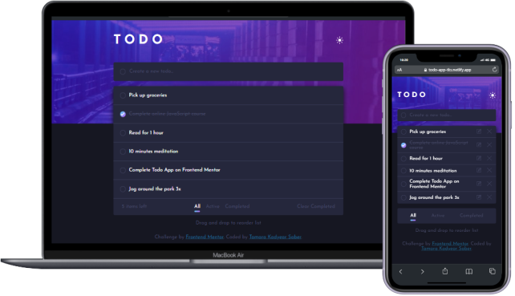

# Todo App Main from Front End Mentor
This is a solution to the [Todo app challenge on Frontend Mentor](https://www.frontendmentor.io/challenges/todo-app-Su1_KokOW). Frontend Mentor challenges help you improve your coding skills by building realistic projects.
## Table of contents
- [Todo App Main from Front End Mentor](#todo-app-main-from-front-end-mentor)
  - [Table of contents](#table-of-contents)
  - [Overview](#overview)
    - [The challenge](#the-challenge)
    - [Links](#links)
    - [Clone this repository](#clone-this-repository)
  - [My process](#my-process)
    - [Built with](#built-with)
    - [What I learned](#what-i-learned)
    - [Continued development](#continued-development)
    - [Useful resources](#useful-resources)
  - [Author](#author)

## Overview

### The challenge

Users should be able to:

- View the optimal layout for the app depending on their device's screen size
- See hover states for all interactive elements on the page
- Add new todos to the list
- Mark todos as complete
- Delete todos from the list
- Filter by all/active/complete todos
- Clear all completed todos
- Toggle light and dark mode
- **Bonus**: Drag and drop to reorder items on the list
- **Bonus**: Store the data in local storage that when I refresh the page I can still see my progress

### Links

- Demo : [https://todo-app-tks.netlify.app/](https://todo-app-tks.netlify.app/)


### Clone this repository
```bash
# Clone this repository
$ git clone https://github.com/TKadyear/Todo-app-main.git

# Go into the repository
$ cd Todo-app-main

# Install dependencies
$ npm install

# Run the local server
$ npm run dev
```

If you want the production server do:
```bash
#For prepare the documents for production:
$ npm run build

#Run the preview of production server

$ npm run preview
```


## My process

### Built with

- Semantic HTML5 markup
- CSS custom properties
- Flexbox
- Javascript native
- Drag and Drop API


### What I learned


```js
  const template = /* html */`
  <li class="task" id=${"task-" + i} draggable="true" tabindex="0">
  <input type="checkbox" value="${data}">
  <label for="${data}">${data}</label>
    <button class="edit"></button>
    <button class="delete"></button>
  </li>
  `
  const range = document.createRange();
  const DocumentTemplate = range.createContextualFragment(template);
```


### Continued development

Use this section to outline areas that you want to continue focusing on in future projects. These could be concepts you're still not completely comfortable with or techniques you found useful that you want to refine and perfect.

### Useful resources

- [CreateRange](https://developer.mozilla.org/en-US/docs/Web/API/Range/createContextualFragment) - This helped me for using the template like another document. I really liked for create HTML in Javascript native.
- [Drag and Drop Example](https://www.javascripttutorial.net/web-apis/javascript-drag-and-drop/) - This article helped me to understand DragAndDrop API. I'd recommend it to anyone who wants understand how works the Drag event.


## Author
- Github - [Tamara Kadyear](https://github.com/TKadyear)
- Frontend Mentor - [Tamara Kadyear](https://www.frontendmentor.io/profile/)


